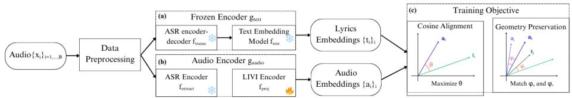
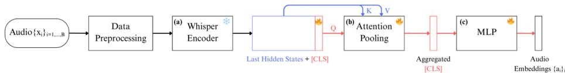
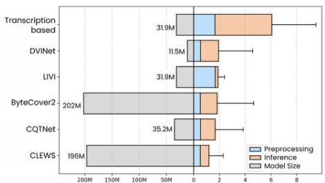

# Scalable Music Cover Retrieval Using Lyrics-Aligned Audio Embeddings

J. Affolter $^ { 1 , 2 }$ , B. Martin1, E. V. Epure1, G. Meseguer-Brocal1, and F. Kaplan2

1 Deezer Research, Paris, France research@deezer.com 2 EPFL, Lausanne, Switzerland

Abstract. Music Cover Retrieval, also known as Version Identification, aims to recognize distinct renditions of the same underlying musical work, a task central to catalog management, copyright enforcement, and music retrieval. State-of-the-art approaches have largely focused on harmonic and melodic features, employing increasingly complex audio pipelines designed to be invariant to musical attributes that often vary widely across covers. While effective, these methods demand substantial training time and computational resources. By contrast, lyrics constitute a strong invariant across covers, though their use has been limited by the difficulty of extracting them accurately and efficiently from polyphonic audio. Early methods relied on simple frameworks that limited downstream performance, while more recent systems deliver stronger results but require large models integrated within complex multimodal architectures. We introduce LIVI (Lyrics-Informed Version Identification), an approach that seeks to balance retrieval accuracy with computational efficiency. First, LIVI leverages supervision from state-of-the-art transcription and text embedding models during training to achieve retrieval accuracy on par with—or superior to—harmonic-based systems. Second, LIVI remains lightweight and efficient by removing the transcription step at inference, challenging the dominance of complexity-heavy pipelines.

Keywords: Music Cover Retrieval · Representation Learning · Audio to Text Alignment

# 1 Introduction

In information retrieval, tasks such as Near-Duplicate Detection [40, 45] and Entity Resolution (or Record Linkage) [57] aim to identify and link semantically equivalent entities. In the music information retrieval domain, an analogous task is Music Cover Retrieval—also known as Version Identification or Cover Detection—where the goal is to recognize distinct renditions of the same underlying composition [49]. Robust systems are critical for catalog management, copyright enforcement, cross-platform track linking, and music retrieval [49].

Defining similarity between covers, however, is challenging: models must account for wide variations in tempo, pitch, structure, lyrics or recording conditions [49]. State-of-the-art approaches have largely focused on harmonic and melodic features, relying on complex pipelines that aim to achieve invariance

to these attributes [18, 26, 30]. While effective, such models demand significant training time and computational resources, and their growing reliance on deep or multimodal architectures further limits scalability and reproducibility [1].

Unlike melodic or harmonic features, which may vary widely across renditions, prior work has shown that lyrics constitute a strong invariant [1, 10, 15, 31, 46]: (i) they are typically preserved across renditions, (ii) they largely retain their semantic content even under translation or minor rewrites, and (iii) they provide decisive cues for distinguishing works that share similar harmonic or melodic profiles. A well-known illustration is Jimi Hendrix’s cover of "All Along the Watchtower" from Bob Dylan, where harmony and melody diverge strongly from the original, yet the lyrics remain largely intact. Despite this, their potential has been underexplored, mainly due to two obstacles: the availability of editorial lyrics at scale—often restricted by third-party licensing—and the challenge of extracting lyrics from polyphonic audio [49], a task where recent advances have improved accuracy but remain computationally demanding. While early works that use lyrics [1, 46] relied on relatively simple approaches to derive lyric representations, resulting in limited downstream performance, more recent work [15, 31] achieved stronger results but integrates transcription into a complex multimodal architecture, increasing model size and computational cost.

Our work builds on the hypothesis that songs with semantically similar lyrics are likely to be covers [10]. To test this idea, we first construct a pipeline that represents songs in a lyric-informed embedding space, obtained by applying an Automatic Speech Recognition (ASR) system followed by a multilingual text encoder. This design is motivated by two factors: (i) clean editorial lyrics are rarely available at scale, making transcription a necessary step, and (ii) modern multilingual text encoders, pretrained for semantic similarity, provide a powerful and readily applicable representation space. While this pipeline achieves strong performance, its reliance on full transcription makes it computationally costly. Motivated by the need for efficiency in real-world deployment, we introduce LIVI (Lyrics-Informed Version Identification), a model that learns to project latent audio representations directly into the lyric embedding space defined by the pipeline. In doing so, LIVI removes the transcription step, reducing inference cost while preserving retrieval accuracy.

Despite its relative simplicity and the absence of explicit fine-tuning for the downstream task, LIVI achieves performance on par with—or superior to—stateof-the-art systems. It delivers an efficient, reproducible3, and domain-grounded alternative, challenging the dominance of complexity-heavy multimodal systems. By design, our method applies only to tracks with sufficient vocal content, with a preprocessing stage used to exclude those lacking it. While this restriction narrows the scope of applicability, its practical impact is limited given the predominance of vocal music in mainstream repertoires and its central role in industrial applications [11]. Moreover, a lyrics-informed approach such as LIVI could naturally be complemented by harmonic features, as in [46], forming part of a broader system that integrates both textual and musical cues.

# 2 Related Works

Version Identification. Research on Music Cover Retrieval has undergone several stages of development over the past two decades. Early systems based on hand-crafted features achieved encouraging results on small benchmarks, but failed to scale due to their reliance on costly alignment techniques such as dynamic time warping (DTW) [33, 49]. The advent of deep learning marked a turning point, enabling data-driven feature learning from harmonic and melodic representations such as predominant melody, pitch class profiles (PCP), or the constant-Q transform (CQT) [50]. Since then, progress has followed two main directions: one line of work pushes towards increasingly deep architectures such as ResNet [2, 15–18, 26, 30, 41, 53, 54], while another emphasizes musically informed inductive biases to achieve invariance to transformations such as transposition or structural changes [1, 13, 14, 50, 51]. Beyond these, multimodal methods that integrate complementary features have demonstrated clear advantages over unimodal models [1, 14, 15, 46].

Although lyrics offer a strong discriminative signal for version identification [1, 15, 31, 46], their integration into Music Cover Retrieval systems is relatively recent, primarily due to the absence of large-scale datasets with clean, time-aligned lyrics and the difficulty of transcribing lyrics from polyphonic audio [49]. In early attempts, [46] adopted a Singing Voice Recognition (SVR) framework combining a TDNN-based acoustic model [22] with a language model to decode phoneme sequences compared via string matching. [1] proposed a lightweight Automatic Lyrics Recognition (ALR) that produced character posteriorgrams subsequently processed by a second, independently trained model fine-tuned for the retrieval task. Although these approaches marked important first steps, they relied on acoustic models to represent lyrics, yielding limited retrieval performance. Moreover, transcription models were trained from scratch on English-only datasets [32], restricting multilingual generalization and adding the overhead of training a separate retrieval model.

Recent advances in lyrics-based cover detection include dedicated datasets, such as LyricsCovers 2.0 [4], and new methods [5, 15, 31, 38]. Among these, [15] achieved stronger results by adapting Whisper [36] with lightweight prefix- and suffix-tuning, enabling faster inference while keeping most parameters frozen. However, the approach remains integrated into a complex multimodal pipeline, increasing model size and computational cost, and making it difficult to isolate the impact of lyrics. Reproducibility is further constrained by the lack of opensource implementations and technical details [1].

Automatic Lyrics Recognition. Modern Automatic Speech Recognition (ASR) systems are based on end-to-end neural architectures that map raw audio directly to text, in contrast to older hybrid pipelines combining hidden Markov models with deep neural networks (HMM-DNN) [29]. Recent advances in Automatic Lyrics Transcription have been driven by systems such as AudioShake v3 [9], which achieves state-of-the-art accuracy but remains proprietary. As an open-source alternative, Whisper [36] has been widely adopted for lyric transcrip-

tion [43]. Its robustness to noise, accents, and other real-world variability makes it particularly suitable for the heterogeneous conditions of music audio [9, 37]. As an encoder–decoder Transformer, Whisper encodes audio into latent representations, which the decoder attends to via cross-attention to generate transcriptions autoregressively.

Audio to Text Alignment. Recent advances in audio–text modeling focus on learning aligned representations across modalities, typically through contrastive pretraining in a shared embedding space. Inspired by CLIP [35], CLAP-style models [12, 20, 25, 27, 55] jointly train audio and text encoders to maximize similarity between paired data, achieving strong zero-shot performance in tagging, retrieval, and captioning. However, these methods typically rely on high-level textual descriptors rather than structured content such as lyrics.

Several works have instead explored aligning audio with lyrics, though with different objectives. Durand et al. [19] proposed a contrastive learning framework in which singing audio and lyric transcripts are encoded as sequences of frame- and token-level embeddings. A similarity matrix is then computed to determine the optimal alignment path, enabling precise word-level synchronization. Yu et al. [52] addressed cross-modal retrieval by training parallel audio and lyric encoders with a Deep Canonical Correlation Analysis (DCCA) loss. Their approach projects spectrogram-based audio features and text embeddings into a joint space, but the reliance on correlation objectives makes training computationally expensive. In contrast, our method learns global song-level embeddings that integrate lyric semantics directly into the audio representation.

# 3 Methodology

We present LIVI (Lyrics-Informed Version Identification), an approach that leverages the invariance of lyrics across renditions to identify covers (Figure 1). Our starting point is a lyrics-informed pipeline designed to maximize retrieval accuracy, without regard to efficiency. Audio is first transcribed using an encoder–decoder ASR model, and the resulting text is then embedded with a multilingual model fine-tuned for semantic similarity. This produces an embedding space in which semantically similar lyrics—even when expressed in different languages—cluster closely, while unrelated text lies further apart.

  
Fig. 1: Overview of the proposed LIVI framework. (a) A frozen text encoder $\left( g _ { \mathrm { t e x t } } \right)$ combines an ASR model with a pre-trained text embedding model to produce lyrics embeddings $t _ { i }$ . (b) An audio encoder (gaudio) projects ASR encoder latent representations into the same embedding space. (c) Training optimizes a combined objective: pointwise alignment of $a _ { i }$ with $t _ { i }$ under cosine similarity, and geometry preservation ensuring that pairwise similarities between audio embeddings mirror those of their corresponding lyric embeddings.

Its key drawback lies in the reliance on transcription, where the ASR autoregressive decoder introduces considerable computational overhead. To overcome this, LIVI discards the decoder and trains an audio encoder to map latent ASR states directly into the lyric-informed embedding space derived from the pipeline. This removes the need for full transcription while preserving retrieval accuracy, resulting in a more efficient and scalable solution.

# 3.1 Problem Formulation

We formulate Music Cover Retrieval as a similarity ranking problem over embeddings produced by an encoder $g$ . Let $\boldsymbol { \mathscr { C } }$ be a catalog of music tracks and $g : { \mathcal { C } }  \mathbb { R } ^ { d }$ map each track $x \in { \mathcal { C } }$ to an embedding $\mathbf { e } _ { x } \in \mathbb { R } ^ { d }$ . Given a query $q \in { \mathcal { C } }$ (i.e., a song), the system assigns to each $x \in \mathcal { C } \setminus \{ q \}$ a cosine similarity score

$$
s (q, x) = \cos (\mathbf {e} _ {q}, \mathbf {e} _ {x}) = \frac {\mathbf {e} _ {q} ^ {\top} \mathbf {e} _ {x}}{\| \mathbf {e} _ {q} \| _ {2} \| \mathbf {e} _ {x} \| _ {2}}
$$

and returns the catalog ordered in descending order by $s ( q , \cdot )$ . Let $\mathcal { V } ( q ) \subset \mathcal { C }$ denote the set of versions of q. The desired ranking property is

$$
s (q, v ^ {+}) > s (q, v ^ {-}) \quad \forall v ^ {+} \in \mathcal {V} (q), v ^ {-} \in \mathcal {C} \setminus \mathcal {V} (q)
$$

Accordingly, the encoder must learn an embedding space in which versions are embedded more closely than to non-versions.

# 3.2 Framework Overview

We first define the lyrics-informed embedding space, demonstrating the effectiveness of lyric semantic similarity for cover song retrieval. This embedding space then serves as supervision for training the audio encoder. Given an audio excerpt $x _ { i }$ from a track $x \in { \mathcal { C } }$ , its lyrics embedding $t _ { i } \in \mathbb { R } ^ { d }$ is obtained by composing an encoder-decoder ASR model $f _ { \mathrm { t r a n s c } }$ with a pre-trained text embedding model $f _ { \mathrm { t e x t } }$ . This composition can be seen as a fixed encoder:

$$
g _ {\mathrm {t e x t}} = f _ {\mathrm {t e x t}} \circ f _ {\mathrm {t r a n s c}}: \left\{ \begin{array}{l} \mathcal {C} \to \mathbb {R} ^ {d} \\ x _ {i} \mapsto t _ {i} \end{array} \right.
$$

Next, we define an audio encoder that projects raw audio into the lyrics-informed embedding space. Given the same audio excerpt $x _ { i }$ , latent features are extracted from the ASR encoder via $f _ { \mathrm { e x t r a c t } }$ and projected by $f _ { \mathrm { p r o j } }$ to yield the audio embedding:

$$
g _ {\mathrm {a u d i o}} = f _ {\mathrm {p r o j}} \circ f _ {\mathrm {e x t r a c t}}: \left\{ \begin{array}{l} \mathcal {C} \to \mathbb {R} ^ {d} \\ x _ {i} \mapsto a _ {i} \end{array} \right.
$$

The objective is to learn $g _ { \mathrm { a u d i o } }$ such that audio embeddings $a _ { i }$ are aligned with their corresponding lyric embeddings $t _ { i }$ under cosine similarity. Formally, this corresponds to minimizing the loss:

$$
\mathcal {L} _ {\cos} = \sum_ {x _ {i} \in \mathcal {C}} \left(1 - s \left(g _ {\text {a u d i o}} \left(x _ {i}\right), g _ {\text {t e x t}} \left(x _ {i}\right)\right)\right)
$$

Yet the training objective can be pushed further given the data available: since the lyrics-informed space is fixed and the target lyrics embeddings are accessible during training, one can leverage not only pointwise alignment but also the geometry of the target space. More specifically, the inter-sample distances between lyrics embeddings can serve as an additional supervision signal to guide the training of the audio encoder. This is achieved by enforcing that pairwise similarities between audio embeddings, $s ( a _ { i } , a _ { j } )$ , match those of the corresponding lyrics embeddings, $s ( t _ { i } , t _ { j } )$ . Formally, given a batch $\{ ( x _ { i } , t _ { i } ) \} _ { i = 1 } ^ { B }$ , this component of the training objective takes the form:

$$
\mathcal {L} _ {\mathrm {M S E}} = \frac {1}{B ^ {2}} \sum_ {i, j = 1} ^ {B} \Big (s (a _ {i}, a _ {j}) - s (t _ {i}, t _ {j}) \Big) ^ {2}.
$$

This yields the final objective optimized during training, combining a pointwise alignment term ${ \mathcal { L } } _ { \mathrm { c o s } }$ with a geometry-preservation term $\mathcal { L } _ { \mathrm { M S E } }$ :

$$
\mathcal {L} _ {\mathrm {t o t a l}} = \alpha \mathcal {L} _ {\mathrm {c o s}} + (1 - \alpha) \mathcal {L} _ {\mathrm {M S E}}, \qquad \alpha \in [ 0, 1 ]
$$

Unlike standard multimodal representation learning [20, 27, 48], which jointly trains both audio and text encoders to construct a joint embedding space, our method fixes the textual space and adapts only the audio encoder. This subtle difference allows the training process to exploit the geometry of the lyricsinformed embedding space directly, rather than relying on implicit structure induced by contrastive objectives and in-batch negatives.

# 4 Implementation Details of LIVI

# 4.1 Data Preprocessing

Because transcription models are trained primarily on speech, they tend to hallucinate in non-vocal sections, generating spurious outputs despite the absence of linguistic content [6, 23, 28, 47]. A dedicated preprocessing stage is therefore introduced to filter out tracks with insufficient lyrical content and extract vocalonly segments. We employ a proprietary model deep learning model to estimate vocalness, as it yields more reliable predictions than Whisper’s integrated voice activity detection, which we found to suffer from lower transcription accuracy and frequent hallucinations (see Section 5.2). This model consists of the Musicnn architecture4 [34], augmented with a single linear layer of dimension 2 for binary classification. It estimates a vocalness probability $\boldsymbol { v }$ for each non-overlapping 3s audio window, and a global vocalness score is obtained by averaging across all windows. Tracks with a score below a threshold $\lambda \in [ 0 , 1 ]$ are excluded to ensure sufficient lyrical content. Second, windows with $v \geq 0 . 5$ are retained as vocal segments, concatenated into contiguous regions, and symmetrically padded by up to 10s to smooth temporal boundaries. The resulting segments are then truncated or zero-padded to a fixed length of 30s to match the input requirements

of the ASR model. For a given track $x \in { \mathcal { C } }$ , this process produces multiple audio segments $x _ { i }$ , which are treated independently from one another and used as inputs to both the frozen text encoder $y _ { \mathrm { t e x t } }$ and the audio encoder $g _ { \mathrm { a u d i o } }$ .

# 4.2 Lyrics-Informed Embedding Space

The lyrics-informed embedding space (Figure 1.a) is defined as $\mathcal T = \{ g _ { \mathrm { t e x t } } ( x _ { i } ) \ |$ $x _ { i } ~ \in ~ { \mathcal { C } } \}$ , where $g _ { \mathrm { t e x t } } ~ = ~ f _ { \mathrm { t e x t } } \circ f _ { \mathrm { t r a n s c } }$ maps an audio excerpt $x _ { i }$ to its lyric embedding $t _ { i } \in \mathbb { R } ^ { d }$ . This space clusters semantically similar lyrics— assumed to represent versions—closer together than unrelated ones, and serves as the target structure for training the audio encoder gaudio.

Transcription model $f _ { t r a n s c }$ Given its suitability for this task (more details in Section 2), we use whisper-large-v3-turbo, an optimized variant of whisper-large-v3 that offers comparable transcription accuracy with up to 8 $\times$ faster inference. Its architecture combines a convolutional front-end, 32 Transformer encoder layers, and a 4-layer Transformer decoder generating transcriptions autoregressively.

Text embedding model $f _ { t e x t }$ As mentioned in 3, the objective is to construct a semantically meaningful space for lyric transcriptions, providing a robust structure for the audio encoder to align with. Recent progress in Natural Language Processing has produced text embedding models especially well suited to this purpose. Most are derived from large pre-trained language models and fine-tuned for semantic similarity, typically within the Sentence-BERT framework [39], which maps full sentences into fixed-size embeddings that preserve semantic proximity—even in multilingual settings. Based on an evaluation of six multilingual text embedding models for the downstream task (see 5.1), we select gte-multilingualbase [56], an encoder-only Transformer that produces 768-dimensional embeddings across more than 70 languages. It achieves SOTA results in multilingual retrieval for models of comparable size [56] and outperforms alternatives in our evaluations. In our case, we rely on this off-the-shelf model without additional fine-tuning, as it already provides strong results. We leave task-specific finetuning for future work, where it could further enhance performance.

# 4.3 Audio Encoder

The audio encoder $g$ audio (Figure 2) maps an audio excerpt $x _ { i } \in \mathcal { C }$ to an embedding $a _ { i } \in \mathbb { R } ^ { d }$ aligned with its lyric-based counterpart $t _ { i } = g _ { \mathrm { t e x t } } ( x _ { i } )$ . Built on top of Whisper’s frozen encoder, which provides frame-level representations subsequently aggregated by an attention-based pooling mechanism, the projection head refines Whisper’s latent space rather than learning cross-modal alignment from scratch. This design keeps the model compact and computationally efficient during both training and inference.

  
Fig. 2: Architecture of the audio encoder $g _ { \bf a u d i o }$ . (a) Raw audio is first processed by the Whisper encoder to obtain hidden representations. (b) A [CLS] token is appended to aggregate frame-level features using an attention pooling mechanism. (c) A multi-layer perceptron projects the pooled representation into the lyrics-informed embedding space, yielding the final audio embedding $_ { a i }$ .

Feature Extractor (Fig. 2.a). We adopt the encoder of the Whisper model used in the lyrics-informed embedding space as our audio backbone. This choice is motivated by two considerations: (i) its internal representations, shaped by the ASR training objective, are expected to capture phonetic and linguistic information [24] that makes them suitable for alignment with lyrics embeddings; and (ii) reusing the encoder from the same ASR model enables our model to specifically target the decoder in order to have an efficient alternative. Consequently, we keep the encoder frozen to preserve this alignment and maintain the latent structure learned during Whisper’s large-scale training. Given an 80-channel log-Mel spectrogram, the encoder produces a sequence of hidden states $H \in \mathbb { R } ^ { L \times d _ { w } }$ , where $d _ { w } = 1 2 8 0$ is the latent dimension and $L = 1 5 0 0$ the number of frames for a 30s input.

Attention-based Temporal Pooling (Fig. 2.b). To reduce frame-level representations into a fixed-dimensional vector suitable for projection into the lyricsinformed embedding space, we adopt an attention-based pooling mechanism inspired by [44]. A learnable [CLS] token $q _ { \mathrm { c l s } } \in \mathbb { R } ^ { d _ { w } }$ is appended to the hidden states $H$ and acts as the sole query in a single-head attention mechanism with Rotary positional embeddings (RoPE) [42]. Formally:

$$
\mathrm {A t t e n t i o n (Q , K , V)} = \mathrm {s o f t m a x} \left(\frac {Q K ^ {\top}}{\sqrt {d _ {k}}}\right) V, \qquad Q = q _ {\mathrm {c l s}} W _ {Q}, K = H W _ {K}, V = H W _ {V}
$$

where $W _ { Q } , W _ { K } , W _ { V } \in \mathbb { R } ^ { d _ { w } \times d _ { k } }$ are learnable projection matrices, and $d _ { k }$ denotes the dimensionality of the key vector, which we set to $d _ { w }$ in our implementation. The attention weights determine the relative importance of each frame, guiding how information from the sequence is aggregated into the [CLS] representation. This representation is then passed through a residual feed-forward block with LayerNorm to yield the final pooled embedding $\boldsymbol { h } \in \mathbb { R } ^ { d _ { w } }$ .

Projection Head (Fig. 2.c). The pooled vector $h$ is finally projected into the 768-dimensional lyric-informed embedding space through a four-layer MLP with hidden sizes [3072, 2048, 2048, 1536]—a configuration selected based on empirical validation, totaling 13.6M trainable parameters. Each intermediate layer is followed by LayerNorm and a ReLU activation, while the final layer outputs the audio embedding $a _ { i }$ used in the downstream retrieval task.

# 5 Experiments

Training Configuration. Training runs for three epochs with batch size 128 on a single NVIDIA RTX A5000 (24GB), taking about 33 hours. We use AdamW (weight decay 0.01, $\beta = ( 0 . 9 , 0 . 9 8 ) )$ with a fixed learning rate of $1 0 ^ { - 4 }$ and linear warmup over the first 10k steps. Mixed precision is enabled for the Whisper encoder, while the rest of the model is trained in full precision. Early stopping is applied based on the average cosine similarity between audio and text embeddings on the validation set. For data, we use a subset of 679,692 entries from Discogs-VI [3], linked to a proprietary catalog to recover the corresponding .mp3 audio. Training pairs $( z _ { i } , t _ { i } )$ are formed by (i) precomputing log-Mel spectrograms $z _ { i }$ with Whisper’s feature extractor on extracted 30s vocal segments $x _ { i }$ (Section 4.1), and (ii) deriving lyrics embeddings $t _ { i }$ through the pipeline described in Section 4.2. We retain a subset of 1.5M pairs, of which 1.2M are used for training, 170k for validation and 170k for testing (80/10/10 split).

Benchmarks. We use the standard Covers80 [21] and SHS100k-TEST [7], along with the test set of Discogs-VI [3], restricted to entries with an available YouTube link. All datasets follow the same preprocessing pipeline: (1) tracks are linked to a proprietary catalog via fingerprinting after matching against YouTube audio with the provided links; and (2) tracks with insufficient vocal content (see Section 4.1) are discarded. At this point, it should be acknowledged that due to our lyrics-centered method, we exclude some of the tracks in the reference datasets. Consequently, $8 2 . 7 6 \%$ of Covers80 (116 tracks in 58 cliques of average size 2), $8 1 . 9 5 \%$ of SHS100k (890 tracks in 105 cliques of average size $7 . 2 8 \pm 6 . 2 9$ ), and 85.29% of Discogs-VI (72,316 tracks in 33,660 cliques of average size $3 . 0 4 \pm 2 . 3 4$ ) are retained for evaluation. We leave as future work the use of different musical modalities to retrieve these instances. Nevertheless, our experiments operate at a large scale of 72,316 tracks for Discogs-VI, yielding an evaluation setting that reflects real-world conditions.

Evaluation. We follow the standard evaluation setting for the retrieval task [50]. Given a query track, the system ranks all other tracks in the dataset according to their cosine similarity with the query in the embedding space (see 3.1), and retrieval performance is assessed using standard metrics: MR1, the mean rank of the first true positive; HR@1, the fraction of queries with the correct cover ranked first; and MAP@10, which evaluates precision within the top 10 results. Note that a query may correspond to multiple covers, with an average of 2 covers per clique in Covers80, 12 in SHS100k, and 6 in Discogs-VI.

# 5.1 Validation of the Lyrics-Informed Embedding Space

We evaluate the lyrics embeddings $t _ { i } = g _ { \mathrm { t e x t } } ( x _ { i } )$ in the downstream retrieval task to assess the performance of the lyrics-informed embedding space. Results are reported in Table 1 across six multilingual text embedding models $f _ { \mathrm { t e x t } }$ , supporting the choice of gte-multilingual-base in our pipeline. To approximate

Table 1: Music Cover Retrieval results across six text embedding models5. Each cell reports $\mathrm { _ { x } | \mathrm { y } }$ , where $_ { x }$ corresponds to results using transcribed lyrics embeddings $t _ { i } = f _ { \mathrm { t r a n s c } } ( f _ { \mathrm { t e x t } } ( x _ { i } ) )$ , and $_ y$ to editorial lyrics embeddings $\begin{array} { r } { \bar { t } _ { i } = f _ { \mathrm { t e x t } } ( \ell _ { i } ) } \end{array}$ . Underline indicates the best result within each row.   

<table><tr><td></td><td colspan="2">Metric</td><td colspan="2">gte-b</td><td colspan="2">e5-s</td><td colspan="2">e5-1</td><td colspan="2">e5-1-inst</td><td colspan="2">jina</td><td colspan="2">mpnet</td></tr><tr><td rowspan="3">C80</td><td>MR1</td><td>↓</td><td>1.101</td><td>1.000</td><td>1.025</td><td>1.000</td><td>1.051</td><td>1.000</td><td>1.013</td><td>1.000</td><td>1.089</td><td>1.000</td><td>3.367</td><td>4.139</td></tr><tr><td>HR1</td><td>↑</td><td>0.975</td><td>1.000</td><td>0.975</td><td>1.000</td><td>0.975</td><td>1.000</td><td>0.987</td><td>1.000</td><td>0.975</td><td>1.000</td><td>0.899</td><td>0.924</td></tr><tr><td>MAP</td><td>↑</td><td>0.987</td><td>1.000</td><td>0.987</td><td>1.000</td><td>0.983</td><td>1.000</td><td>0.994</td><td>1.000</td><td>0.977</td><td>1.000</td><td>0.914</td><td>0.921</td></tr><tr><td rowspan="3">SHS</td><td>MR1</td><td>↓</td><td>2.810</td><td>4.033</td><td>5.612</td><td>4.826</td><td>3.446</td><td>2.190</td><td>3.413</td><td>2.620</td><td>3.934</td><td>4.851</td><td>4.702</td><td>5.050</td></tr><tr><td>HR1</td><td>↑</td><td>0.909</td><td>0.917</td><td>0.909</td><td>0.909</td><td>0.926</td><td>0.934</td><td>0.926</td><td>0.917</td><td>0.909</td><td>0.926</td><td>0.884</td><td>0.909</td></tr><tr><td>MAP</td><td>↑</td><td>0.852</td><td>0.863</td><td>0.829</td><td>0.842</td><td>0.858</td><td>0.866</td><td>0.867</td><td>0.863</td><td>0.863</td><td>0.880</td><td>0.836</td><td>0.848</td></tr><tr><td rowspan="3">D-VI</td><td>MR1</td><td>↓</td><td>13.21</td><td>12.16</td><td>14.56</td><td>21.22</td><td>15.33</td><td>19.53</td><td>13.44</td><td>16.96</td><td>13.81</td><td>17.44</td><td>40.95</td><td>39.96</td></tr><tr><td>HR1</td><td>↑</td><td>0.929</td><td>0.934</td><td>0.927</td><td>0.924</td><td>0.922</td><td>0.919</td><td>0.926</td><td>0.923</td><td>0.925</td><td>0.924</td><td>0.878</td><td>0.902</td></tr><tr><td>MAP</td><td>↑</td><td>0.893</td><td>0.913</td><td>0.890</td><td>0.895</td><td>0.891</td><td>0.897</td><td>0.897</td><td>0.901</td><td>0.886</td><td>0.905</td><td>0.800</td><td>0.861</td></tr></table>

the upper bound of text embedding performance, we further assess the models on editorial lyrics $\ell _ { i }$ rather than transcriptions, thus eliminating transcription noise. This evaluation is limited to subsets of the datasets for which editorial lyrics are available in our proprietary catalog, yielding 116, 167, and 4,623 tracks for Covers80, SHS100k, and Discogs-VI.

Among the six candidates, gte-multilingual-base emerges as the most effective since it ranks first across nearly all metrics on Discogs-VI, the largest and most representative benchmark of real-world conditions. Its performance approaches the ceiling defined by editorial lyrics, underscoring both its robustness to transcription noise and its suitability as the backbone of our pipeline. Additionally, results show that most multilingual encoders achieve competitive scores and, notably, reach ceiling performance on Covers80 when provided with editorial lyrics. This underscores the role of lyrics as a stable and discriminative signal for Music Cover Retrieval and validates the lyrics-informed embedding space as a robust supervisory signal: it captures the semantic structure necessary to distinguish versions. In our case, we rely on off-the-shelf multilingual models without additional fine-tuning, as they already provide strong results. We leave task-specific fine-tuning for future work, where it could further enhance performance.

# 5.2 Validation of the Vocal Detection Model

To assess the gains of the proprietary vocal detection model over Whisper’s integrated Vocal Activity Detection (VAD) module, we evaluate transcription quality on the Discogs-VI test set restricted to tracks with editorial lyrics (4,623 tracks). We compare Word Error Rate (WER) between editorial lyrics and Whisper transcriptions obtained either from vocal segments extracted with the proprietary model or from non-overlapping 30-second segments processed with Whisper’s VAD. In addition, we analyze hallucinated outputs commonly observed in Whisper transcriptions of non-spech audio (e.g., “thank you”, “music”, “subtitle”) [6].

While WER differences are not statistically significant, the average number of hallucinations per track is significantly lower with the proprietary model ( $\mathrm { ~ p ~ } =$ $1 . 2 4 \times 1 0 ^ { - 6 }$ ), decreasing from 0.51 to 0.25. The total number of hallucinations across all transcriptions is likewise reduced (1,023 vs. 509).

# 5.3 Alignment of Audio with Lyrics-Informed Embeddings

We evaluate the performance of the audio encoder $g _ { \mathrm { a u d i o } }$ by examining whether it fulfills its training objective, namely aligning audio embeddings with their lyric-based counterparts. Alignment is assessed at both the segment and track levels under cosine similarity. At the segment level, cosine similarity is computed for each of the 167,484 audio–lyrics embedding pairs $( a _ { i } , t _ { i } )$ taken from the test split of the audio encoder training phase, with $a _ { i } = g _ { \mathrm { a u d i o } } ( x _ { i } )$ and $t _ { i } = g _ { \mathrm { t e x t } } ( x _ { i } )$ . At the track level, segment embeddings from the same recording are averaged to form a global representation, which is then compared against the lyrics embedding derived from the full transcription (60,524 tracks). Segment-level embeddings yield a mean similarity of 0.8574 (std: 0.0757), while aggregated track-level embeddings reach 0.9109 (std: 0.0379). While the higher mean and lower variance at the track level suggest that the encoder integrates local cues into stable global representations, the results further demonstrate that our approach achieves tight audio-lyric alignment.

# 5.4 Application to Music Cover Retrieval

We evaluate in Table 2 the audio encoder $g _ { \mathrm { a u d i o } }$ on the retrieval task by computing segment-level embeddings $a _ { i } = g _ { \mathrm { a u d i o } } ( x _ { i } )$ for all vocal segments $x _ { i }$ of each track (see Section 4.1) and aggregating them into a global representation. To disentangle the contributions of our method, we first use lyrics embeddings as an approximate upper bound, since LIVI is trained to project audio into this space: local embeddings $t _ { i } = g _ { \mathrm { t e x t } } ( x _ { i } )$ are averaged into $t _ { \mathrm { l o c a l } }$ , while global embeddings $t _ { \mathrm { g l o b a l } }$ are computed from full transcriptions. As a second ablation, we introduce a Whisper baseline obtained by mean-pooling frame-level encoder states (Figure 1.a); this removes the projection module and training stage, thereby isolating the effect of LIVI’s alignment beyond raw ASR features. Finally, we compare against state-of-the-art systems for version identification [2, 16, 41, 54]6, using official implementations and pretrained checkpoints from [41].

LIVI consistently outperforms lyrics embeddings derived from averaged local segments and approaches—or even surpasses—the upper bound defined by global embeddings. Whisper embeddings, by contrast, yield poor performance across all datasets, underscoring the gains from LIVI’s architecture and training strategy. Through attention-based pooling and a projection network, Whisper’s outputs are effectively mapped into the lyrics-informed embedding space, producing representations sufficiently discriminative to recognize versions. Compared to audio baselines, LIVI delivers competitive or superior performance, with particularly

Table 2: Comparison of LIVI audio encoder against transcription-, Whisper-, and audio-based baselines for Music Cover Retrieval. $t _ { \mathrm { g l o b a l } }$ denotes lyrics embeddings from the full transcription, while $t _ { \mathrm { l o c a l } }$ and LIVI correspond to the mean of 30s segment-level embeddings (lyrics and audio). Bold numbers indicate the best result and underlined numbers the second-best within each row. † denotes a significant difference $\mathrm { ( p { < } 0 . 0 5 }$ , Holm-Bonferroni-corrected - Wilcoxon Signed-Rank Test for MR1 and MAP, McNemar’s Test for HR1) to LIVI.   

<table><tr><td></td><td colspan="2">Metric</td><td>LIVI</td><td>tglobal</td><td>tlocal</td><td>Whisper</td><td>Bytecover2</td><td>CLEWS</td><td>CQTNet</td><td>DViNet</td></tr><tr><td rowspan="3">C80</td><td>MR1</td><td>↓</td><td>1.51</td><td>1.10</td><td>1.92</td><td>7.67†</td><td>1.57</td><td>2.24</td><td>3.43</td><td>3.05</td></tr><tr><td>HR1</td><td>↑</td><td>0.949</td><td>0.975</td><td>0.937</td><td>0.632†</td><td>0.865</td><td>0.835</td><td>0.848</td><td>0.861</td></tr><tr><td>MAP</td><td>↑</td><td>0.966</td><td>0.979</td><td>0.945</td><td>0.691†</td><td>0.877</td><td>0.880</td><td>0.856</td><td>0.886</td></tr><tr><td rowspan="3">SHS</td><td>MR1</td><td>↓</td><td>3.25</td><td>6.05</td><td>5.52</td><td>6.56†</td><td>4.66</td><td>3.97</td><td>5.59</td><td>7.63</td></tr><tr><td>HR1</td><td>↑</td><td>0.935</td><td>0.954</td><td>0.925</td><td>0.777†</td><td>0.953</td><td>0.931</td><td>0.900</td><td>0.931</td></tr><tr><td>MAP</td><td>↑</td><td>0.875</td><td>0.910</td><td>0.870†</td><td>0.558†</td><td>0.884</td><td>0.847†</td><td>0.789†</td><td>0.859†</td></tr><tr><td rowspan="3">D-VI</td><td>MR1</td><td>↓</td><td>232.21</td><td>275.77</td><td>360.21†</td><td>1051.36†</td><td>312.32†</td><td>410.39†</td><td>810.89†</td><td>507.04†</td></tr><tr><td>HR1</td><td>↑</td><td>0.853</td><td>0.856†</td><td>0.843</td><td>0.524†</td><td>0.843†</td><td>0.816†</td><td>0.641†</td><td>0.751†</td></tr><tr><td>MAP</td><td>↑</td><td>0.923</td><td>0.832†</td><td>0.817†</td><td>0.406†</td><td>0.812†</td><td>0.790†</td><td>0.568†</td><td>0.719†</td></tr></table>

strong results on Covers80 and Discogs-VI, where it outperforms all in HR@1 and MAP@10. On SHS100k, Bytecover2 slightly outperforms LIVI, but this difference can be partially explained by dataset characteristics: SHS100k includes a notable fraction of parodies, covers that preserve the melody but replace lyrics with ironic content, which are challenging for our lyrics-centered approach. While differences on Covers80 and SHS100k are often not statistically significant, likely due to limited dataset sizes and ceiling effects across models, LIVI achieves statistically significant improvements over all audio baselines across all metrics on the largest and most diverse benchmark Discogs-VI.

Together, these results show that LIVI generalizes effectively to Music Cover Retrieval. It nearly matches the lyrics-based upper bound, clearly outperforms raw Whisper representations, and competes with or surpasses state-of-the-art audio baselines on vocal tracks. Its relatively simple and reproducible design contrasts with the complexity of models like ByteCover2, yet its performance across datasets establishes LIVI as a compact and powerful alternative.

# 5.5 Model Size and Inference

A central motivation for LIVI was to circumvent the computational costs of Whisper’s autogressive decoding process. To quantify efficiency gains, we measure end-to-end latency on 200 randomly sampled tracks from Discogs-VI, com-

  
Fig. 3: Runtime and model size comparison. Average preprocessing and inference times are shown alongside model sizes for LIVI and baseline models. Error bars denote std across runs.

paring LIVI with the transcription-based and audio baselines. For all models, we separate preprocessing (audio loading for audio baselines, plus vocal detection for LIVI) from model inference (forward pass). We also report model size in terms of trainable parameters (Figure 3). The transcription pipeline requires on average 6.07s per track, with Whisper alone contributing 4.41s. LIVI reduces total latency to 1.90s, corresponding to a 3.2 $\times$ end-to-end speed-up. Where LIVI truly stands out is at the inference stage: its forward pass completes in 0.22s, nearly 20 $\times$ faster than Whisper and 3–6× faster than audio baselines (0.66–1.40s). In addition, its latency variance is much lower (std. 0.12 vs. 1.03–2.66), ensuring more predictable and stable performance. The main overhead instead arises from the preprocessing stage, where vocal detection and segmentation remain relatively costly compared to the inference of LIVI itself. Reducing this cost therefore represents an important direction for future work. Yet LIVI offers a favorable trade-off between complexity and accuracy when compared to baselines. With 31.9M parameters, it is substantially lighter than large systems such as ByteCover2 (202.3M) and CLEWS (196.8M) while remaining competitive in accuracy, and it surpasses similarly sized models like CQTNet and DViNet, particularly on large-scale benchmarks such as Discogs-VI.

# 6 Conclusion

This work introduced LIVI, an approach for Music Cover Retrieval that balances retrieval accuracy with computational efficiency. With no task-specific fine-tuning and a relatively simple architecture, it stands in contrast to the prevailing trend toward increasingly complex and resource-intensive models. Yet, when tracks have lyrics, LIVI achieves performance on par with these systems, demonstrating that musically informed inputs—rather than architectural escalation—can deliver state-of-the-art results while remaining computationally efficient at both training and inference.

Several limitations of the proposed approach should be acknowledged. First, the text embedding model is used off-the-shelf and is not fine-tuned specifically for the retrieval task, leaving room for further performance gains. Second, LIVI is inherently restricted to musical content with sufficient vocal material; purely instrumental tracks or songs with minimal vocals are therefore excluded, limiting the universality of the method and making its applicability dependent on the availability and quality of lyrics information. Incorporating complementary harmonic features could help mitigate this limitation, particularly for cover versions that preserve melodic structure while substantially altering lyrics or falling outside the scope of the current model. Third, the vocal detection component used during preprocessing is proprietary, which impacts full reproducibility; however, open-source alternatives [8, 37] for vocal activity detection could be explored with limited changes to the pipeline. Finally, although the vocal detection and segmentation stages improve transcription quality, they introduce additional computational overhead that one might want to reduce to gain a substantial runtime improvement compared to audio-only systems such as ByteCover.

# Bibliography

[1] Abrassart, M., Doras, G.: And what if two musical versions don’t share melody, harmony, rhythm, or lyrics? In: Proceedings of the 23rd International Society for Music Information Retrieval Conference (ISMIR). pp. 677–684. Bengaluru, India (2022), https://archives.ismir.net/ ismir2022/paper/000081.pdf   
[2] Araz, R.O., Serrà, J., Serra, X., Mitsufuji, Y., Bogdanov, D.: Discogs-vinetmirex. In: Proceedings of the 25th International Society for Music Information Retrieval Conference (ISMIR) (2024), technical report submitted as MIREX 2024 entry   
[3] Araz, R.O., Serra, X., Bogdanov, D.: Discogs-vi: A musical version identification dataset based on public editorial metadata. In: Proceedings of the 25th International Society for Music Information Retrieval Conference (ISMIR). pp. 541–548. San Francisco, USA (2024)   
[4] Balluff, M., Auch, M., Mandl, P., Wolff, C.: Lyriccovers 2.0: An enhanced dataset for cover song analysis. IADIS International Journal on WWW/Internet 22(2), 75–92 (2024)   
[5] Balluff, M., Mandl, P., Wolff, C.: Innovations in cover song detection: A lyrics-based approach (2024), https://arxiv.org/abs/2406.04384   
[6] Barański, M., Jasiński, J., Bartolewska, J., Kacprzak, S., Witkowski, M., Kowalczyk, K.: Investigation of whisper asr hallucinations induced by nonspeech audio. In: ICASSP 2025 - 2025 IEEE International Conference on Acoustics, Speech and Signal Processing (ICASSP). p. 1–5. IEEE (Apr 2025). https://doi.org/10.1109/icassp49660.2025.10890105, http: //dx.doi.org/10.1109/ICASSP49660.2025.10890105   
[7] Bertin-Mahieux, T., Ellis, D.P.W., Whitman, B., Lamere, P.: The million song dataset. In: Proceedings of the 12th International Society for Music Information Retrieval Conference (ISMIR). pp. 591–596. Miami, Florida, USA (2011), https://ismir2011.ismir.net/papers/OS6-1.pdf   
[8] Bredin, H.: pyannote.audio 2.1 speaker diarization pipeline: principle, benchmark, and recipe. In: Proc. INTERSPEECH 2023 (2023)   
[9] Cífka, O., Schreiber, H., Miner, L., Stöter, F.R.: Lyrics transcription for humans: A readability-aware benchmark. In: Proceedings of the 25th International Society for Music Information Retrieval Conference (ISMIR). pp. 145–152. San Francisco, USA (2024)   
[10] Correya, A., Hennequin, R., Arcos, M.: Large-scale cover song detection in digital music libraries using metadata, lyrics and audio features. In: Proceedings of the 19th International Society for Music Information Retrieval Conference (ISMIR). pp. 237–243. Paris, France (2018)   
[11] Demetriou, A.M., Jansson, A., Kumar, A., Bittner, R.M.: Vocals in music matter: the relevance of vocals in the minds of listeners. In: Proceedings of the 19th International Society for Music Information Retrieval Con-

ference. pp. 514–520. Paris, France (2018), http://ismir2018.ircam.fr/ doc/pdfs/98_Paper.pdf   
Dinkel, H., Yan, Z., Wang, T., Wang, Y., Sun, X., Niu, Y., Liu, J., Li, G., Zhang, J., Luan, J.: Glap: General contrastive audio-text pretraining across domains and languages (2025)   
Doras, G., Peeters, G.: Cover detection using dominant melody embeddings. In: Proceedings of the 20th International Society for Music Information Retrieval Conference (ISMIR). pp. 107–114. Delft, The Netherlands (2019), https://archives.ismir.net/ismir2019/paper/000010.pdf   
Doras, G., Yesiler, F., Serrà, J., Gómez, E., Peeters, G.: Combining musical features for cover detection. In: Proceedings of the 21st International Society for Music Information Retrieval Conference (ISMIR). Montreal, Canada (2020), https://archives.ismir.net/ismir2020/paper/000239.pdf   
Du, X.: X-cover: Better music version identification system by integrating pretrained asr model. In: Proceedings of the 25th International Society for Music Information Retrieval Conference (ISMIR). San Francisco, USA (2024). https://doi.org/10.5281/zenodo.14877280   
Du, X., Chen, K., Wang, Z., Zhu, B., Ma, Z.: Bytecover2: Towards dimensionality reduction of latent embedding for efficient cover song identification. In: ICASSP 2022 - 2022 IEEE International Conference on Acoustics, Speech and Signal Processing (ICASSP). pp. 616–620 (2022). https://doi.org/10.1109/ICASSP43922.2022.9747630   
Du, X., Wang, Z., Liang, X., Liang, H., Zhu, B., Ma, Z.: Bytecover3: Accurate cover song identification on short queries. In: Proceedings of the IEEE International Conference on Acoustics, Speech and Signal Processing (ICASSP). pp. 1–5. Toronto, Canada (2023). https://doi.org/10.1109/ ICASSP49357.2023.10095389   
Du, X., Yu, Z., Zhu, B., Chen, X., Ma, Z.: Bytecover: Cover song identification via multi-loss training. In: Proceedings of the IEEE International Conference on Acoustics, Speech and Signal Processing (ICASSP). Toronto, Canada (2021). https://doi.org/10.1109/ICASSP39728.2021.9414128   
Durand, S., Stoller, D., Ewert, S.: Contrastive learning-based audio to lyrics alignment for multiple languages. In: ICASSP 2023 - 2023 IEEE International Conference on Acoustics, Speech and Signal Processing (ICASSP). p. 1–5. IEEE (Jun 2023). https://doi.org/10.1109/icassp49357.2023. 10096725   
Elizalde, B., Deshmukh, S., Ismail, M.A., Wang, H.: Clap learning audio concepts from natural language supervision. In: ICASSP 2023 - 2023 IEEE International Conference on Acoustics, Speech and Signal Processing (ICASSP). pp. 1–5 (2023). https://doi.org/10.1109/ICASSP49357. 2023.10095889   
Ellis, D.P.W.: The “covers80” cover song data set (2007), http://labrosa. ee.columbia.edu/projects/coversongs/covers80, accessed: 2025-03-27   
Fan, C., Liu, B., Tao, J., Yi, J., Wen, Z., Song, L.: Deep time delay neural network for speech enhancement with full data learning. In: 2021 12th In-

ternational Symposium on Chinese Spoken Language Processing (ISCSLP). pp. 1–5 (2021). https://doi.org/10.1109/ISCSLP49672.2021.9362059   
[23] Frieske, R., Shi, B.E.: Hallucinations in neural automatic speech recognition: Identifying errors and hallucinatory models (2024), https://arxiv.org/ abs/2401.01572   
[24] Glazer, N., Segal-Feldman, Y., Segev, H., Shamsian, A., Buchnick, A., Hetz, G., Fetaya, E., Keshet, J., Navon, A.: Beyond transcription: Mechanistic interpretability in asr (08 2025). https://doi.org/10.48550/arXiv.2508. 15882   
[25] Guzhov, A., Raue, F., Hees, J., Dengel, A.: Audioclip: Extending clip to image, text and audio. In: ICASSP 2022 - 2022 IEEE International Conference on Acoustics, Speech and Signal Processing (ICASSP). pp. 976–980 (2022). https://doi.org/10.1109/ICASSP43922.2022.9747631   
[26] Hu, S., Zhang, B., Lu, J., Jiang, Y., Wang, W., Kong, L., Zhao, W., Jiang, T.: Wideresnet with joint representation learning and data augmentation for cover song identification. In: Interspeech 2022. pp. 4187–4191 (2022). https://doi.org/10.21437/Interspeech.2022-10600   
[27] Huang, Q., Jansen, A., Lee, J., Ganti, R., Li, J.Y., Ellis, D.P.W.: Mulan: A joint embedding of music audio and natural language. In: Proceedings of the 23rd International Society for Music Information Retrieval Conference (ISMIR) (2022), https://archives.ismir.net/ismir2022/paper/ 000067.pdf   
[28] Koenecke, A., Choi, A.S.G., Mei, K.X., Schellmann, H., Sloane, M.: Careless whisper: Speech-to-text hallucination harms. In: The 2024 ACM Conference on Fairness, Accountability, and Transparency. p. 1672–1681. FAccT ’24, ACM (Jun 2024). https://doi.org/10.1145/3630106.3658996, http:// dx.doi.org/10.1145/3630106.3658996   
[29] Li, L., Zhao, Y., Jiang, D., Zhang, Y., Wang, F., Gonzalez, I., Valentin, E., Sahli, H.: Hybrid deep neural network–hidden markov model (dnn-hmm) based speech emotion recognition. In: 2013 Humaine Association Conference on Affective Computing and Intelligent Interaction. pp. 312–317 (2013). https://doi.org/10.1109/ACII.2013.58   
[30] Liu, F., Tuo, D., Xu, Y., Han, X.: Coverhunter: Cover song identification with refined attention and alignments. In: 2023 IEEE International Conference on Multimedia and Expo (ICME). pp. 1080–1085 (2023). https: //doi.org/10.1109/ICME55011.2023.00189   
[31] Mancini, E., Serrà, J., Torroni, P., Mitsufuji, Y.: Leveraging whisper embeddings for audio-based lyrics matching (2025), https://arxiv.org/abs/ 2510.08176   
[32] Meseguer-Brocal, G., Cohen-Hadria, A., Peeters, G.: Dali: A large dataset of synchronized audio, lyrics and notes, automatically created using teacherstudent machine learning paradigm. (2018). https://doi.org/10.5281/ ZENODO.1492443   
[33] Müller, M.: Dynamic Time Warping, pp. 69–84. Springer Berlin Heidelberg, Berlin, Heidelberg (2007). https://doi.org/10.1007/ 978-3-540-74048-3_4

[34] Pons, J., Serra, X.: musicnn: Pre-trained convolutional neural networks for music audio tagging (2019), https://archives.ismir.net/ismir2019/ latebreaking/000038.pdf   
[35] Radford, A., Kim, J.W., Hallacy, C., Ramesh, A., Goh, G., Agarwal, S., Sastry, G., Askell, A., Mishkin, P., Clark, J., Krueger, G., Sutskever, I.: Learning transferable visual models from natural language supervision. In: International Conference on Machine Learning (2021), https: //api.semanticscholar.org/CorpusID:231591445   
[36] Radford, A., Kim, J.W., Xu, T., Brockman, G., McLeavey, C., Sutskever, I.: Robust speech recognition via large-scale weak supervision (2022), https: //arxiv.org/abs/2212.04356   
[37] Radford, A., Kim, J.W., Xu, T., Brockman, G., McLeavey, C., Sutskever, I.: Robust speech recognition via large-scale weak supervision. In: Proceedings of the 40th International Conference on Machine Learning. ICML’23, JMLR.org (2023)   
[38] Rathnaweera, A.H.: A language-independent method for lyrics-based cover song identification using phoneme transcriptions (May 2024), supervisor: Dr. M.I.E. Wickramasinghe, Co-Supervisor: Mr. W.R.N.S. Abeyweera   
[39] Reimers, N., Gurevych, I.: Sentence-bert: Sentence embeddings using siamese bert-networks. In: Conference on Empirical Methods in Natural Language Processing (2019), https://api.semanticscholar.org/ CorpusID:201646309   
[40] Rodier, S., Carter, D.: Online near-duplicate detection of news articles. In: Calzolari, N., Béchet, F., Blache, P., Choukri, K., Cieri, C., Declerck, T., Goggi, S., Isahara, H., Maegaard, B., Mariani, J., Mazo, H., Moreno, A., Odijk, J., Piperidis, S. (eds.) Proceedings of the Twelfth Language Resources and Evaluation Conference. pp. 1242–1249. European Language Resources Association, Marseille, France (May 2020), https://aclanthology.org/ 2020.lrec-1.156/   
[41] Serrà, J., Araz, R.O., Bogdanov, D., Mitsufuji, Y.: Supervised contrastive learning from weakly-labeled audio segments for musical version matching. In: ICML 2025 Workshop (2025), poster, in press   
[42] Su, J., Ahmed, M., Lu, Y., Pan, S., Bo, W., Liu, Y.: Roformer: Enhanced transformer with rotary position embedding. Neurocomput. 568(C) (Feb 2024). https://doi.org/10.1016/j.neucom.2023.127063   
[43] Syed, J., Meresman Higgs, I., Cífka, O., Sandler, M.: Exploiting music source separation for automatic lyrics transcription with whisper. pp. 1– 6 (06 2025). https://doi.org/10.1109/ICMEW68306.2025.11152264   
[44] Touvron, H., Cord, M., El-Nouby, A., Bojanowski, P., Joulin, A., Synnaeve, G., Jégou, H.: Augmenting convolutional networks with attention-based aggregation (12 2021). https://doi.org/10.48550/arXiv.2112.13692   
[45] Tumre, S., Patil, S., Kumar, A.: Improved near-duplicate detection for aggregated and paywalled news-feeds. In: Chen, W., Yang, Y., Kachuee, M., Fu, X.Y. (eds.) Proceedings of the 2025 Conference of the North American Chapter of the Association for Computational Linguistics: Human Language Technologies (Volume 3: Industry Track). pp. 979–987. Associa-

tion for Computational Linguistics, Albuquerque, New Mexico (Apr 2025). https://doi.org/10.18653/v1/2025.naacl-industry.73   
[46] Vaglio, A., Hennequin, R., Moussallam, M., Richard, G.: The words remain the same: Cover detection with lyrics transcription. In: 22nd International Society for Music Information Retrieval Conference ISMIR 2021 (2021), https://archives.ismir.net/ismir2021/paper/000089.pdf   
[47] Wang, Alhmoud, Alsahly, Alqurishi, Ravanelli: Calm-whisper: Reduce whisper hallucination on non-speech by calming crazy heads down. In: Proceedings of Interspeech 2025 Conference. pp. 3414–3418. Rotterdam, The Netherlands (2025)   
[48] Wu, Y., Chen, K., Zhang, T., Hui, Y., Berg-Kirkpatrick, T., Dubnov, S.: Large-scale contrastive language-audio pretraining with feature fusion and keyword-to-caption augmentation. In: ICASSP 2023 - 2023 IEEE International Conference on Acoustics, Speech and Signal Processing (ICASSP). pp. 1–5 (2023). https://doi.org/10.1109/ICASSP49357.2023.10095969   
[49] Yesiler, F., Doras, G., Bittner, R.M., Tralie, C.J., Serra, J.: Audio-based musical version identification: Elements and challenges. IEEE Signal Processing Magazine 38(6), 115–136 (Nov 2021). https://doi.org/10.1109/ msp.2021.3105941   
[50] Yesiler, F., Serrà, J., Gómez, E.: Accurate and scalable version identification using musically-motivated embeddings. In: Proceedings of the IEEE International Conference on Acoustics, Speech and Signal Processing (ICASSP). pp. 21–25. Barcelona, Spain (2020). https://doi.org/10. 1109/ICASSP40776.2020.9053793   
[51] Yesiler, F., Serrà, J., Gómez, E.: Less is more: Faster and better music version identification with embedding distillation. In: Proceedings of the 21st International Society for Music Information Retrieval Conference (ISMIR). Montreal, Canada (2020), https://archives.ismir.net/ ismir2020/paper/000244.pdf   
[52] Yu, Y., Tang, S., Raposo, F.A., Chen, L.: Deep cross-modal correlation learning for audio and lyrics in music retrieval. ACM Transactions on Multimedia Computing, Communications, and Applications (TOMM) 15, 1 – 16 (2017), https://api.semanticscholar.org/CorpusID:28221141   
[53] Yu, Z., Xu, X., Chen, X., Yang, D.: Temporal pyramid pooling convolutional neural network for cover song identification. In: Proceedings of the 28th International Joint Conference on Artificial Intelligence. p. 4846–4852. IJCAI’19, AAAI Press (2019)   
[54] Yu, Z., Xu, X., Chen, X., Yang, D.: Learning a representation for cover song identification using convolutional neural network. In: ICASSP 2020 - 2020 IEEE International Conference on Acoustics, Speech and Signal Processing (ICASSP). pp. 541–545 (2020). https://doi.org/10.1109/ICASSP40776. 2020.9053839   
[55] Yuan, Y., Chen, Z., Liu, X., Liu, H., Xu, X., Jia, D., Chen, Y., Plumbley, M.D., Wang, W.: T-clap: Temporal-enhanced contrastive languageaudio pretraining. In: 2024 IEEE 34th International Workshop on Ma-

chine Learning for Signal Processing (MLSP). pp. 1–6 (2024). https: //doi.org/10.1109/MLSP58920.2024.10734763   
[56] Zhang, X., Zhang, Y., Long, D., Xie, W., Dai, Z., Tang, J., Lin, H., Yang, B., Xie, P., Huang, F., et al.: mgte: Generalized long-context text representation and reranking models for multilingual text retrieval. In: Proceedings of the 2024 Conference on Empirical Methods in Natural Language Processing: Industry Track. pp. 1393–1412 (2024)   
[57] Zhao, Z., Guo, Y., Wang, D., Huang, Y., He, X., Gu, B.: Graph-based aspect representation learning for entity resolution. In: Proceedings of the Graphbased Methods for Natural Language Processing (TextGraphs). pp. 15–23. Barcelona, Spain (Online) (2020). https://doi.org/10.18653/v1/2020. textgraphs-1.2